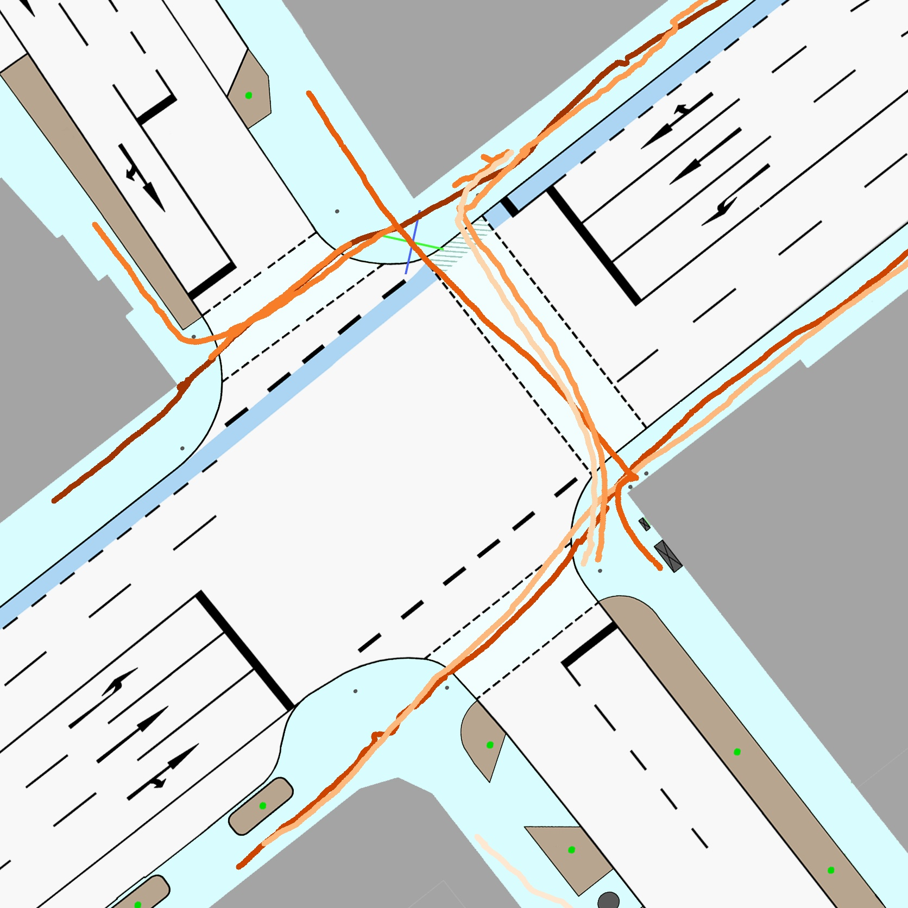
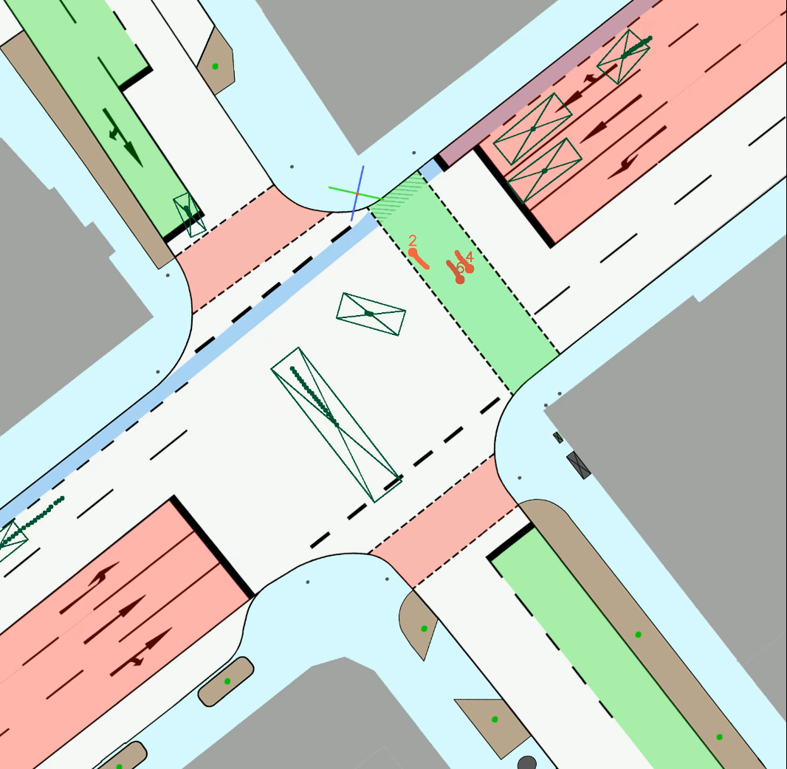

### The IMPTC Dataset: An Infrastructural Multi-Person Trajectory and Context Dataset


This repository contains all information for the IMPTC Dataset:\
[**M. Hetzel, H. Reichert, G. Reitberger, K. Doll, E. Fuchs, and B. Sick "The IMPTC Dataset: An Infrastructural Multi-Person Trajectory and Context Dataset", IV 2023, Anchorage USA.**](https://arxiv.org/)


### Table of contents
* [Important Information](#information)
* [The Dataset](#dataset)
* [Example](#example)
* [Download](#download)
* [Citation](#citation)
* [License](#license)

<a name="information"></a>
## Important Information

#### Release Schedule:
**June 2023: Conference and Paper release**

**July 2023: Availability of Sample Sequences**\
After the conference three sample sequences will be released in july 2023. 

**August 2023: Availability of the first 50 Sequences**\
The first set of 50 complete sequences will be released in august.


<a name="dataset"></a>
## The Dataset
The dataset consists of 250 unaffected Sequences recorded on everyday public road traffic. The sequences are recorded at different daytimes, seasons and weather conditions using a combination of LiDAR abd camera sensors.


**Object types and context data:**\
The dataset covers 8 different classes of road users and additional context information. The following table gives an overview.
| VRU Classes | Vehicle Classes | Context Data |
|---|---|---|
| Pedestrian | Car | Traffic Light Signals |
| Cyclist | Bus/Truck | Weather Status |
| Motorcycle | Unknown | Ground Location |
| Scooter Driver |  | Ground Type |
| Wheelchair Driver |  | GPS Timestamps |

**Ground Types:**\
The following seven different ground types are included.
| Ground types |
|---|
| Road, Bicycle Lane, Sidewalk, Crossing, Curb, Road Line, Ground |

**Weather Data:**\
The following four weather classifications and seven weather parameters are included.
| Classifaction | Parameters |
|---|---|
| Sunny/Cloudy, Rainy, Snowfall, Foggy | Temperatur, Precipitation Type, Precipitation Amount , Wind Direction, Wind Force, visibility |

**Traffic Light Signal Data:**\
The following five traffic light signal types are included. In total nine traffic light signal groups are tracked.
| Classifaction |
|---|
| Green, Yellow, Red, Yellow-Red, Off | 


<a name="example"></a>
## Example

<p align="left">


</p>

work in progress - tba


<a name="download"></a>
## Download
work in progress - tba


<a name="citation"></a>
## Citation
If you use our dataset, please cite:
```
@inproceedings{hetzel2023imptc,
  author = {Hetzel, Manuel and Reichert, Hannes and Reitberger, Günther and Doll, Konrad and Sick, Bernhard and Fuchs, Erich},
  booktitle = {IEEE Intelligent Vehicles Symposium (IV)},
  title = {The {IMPTC} Dataset: An Infrastructural Multi-Person Trajectory and Context Dataset},
  year = 2023
}
```


<a name="license"></a>
## License
This project is licensed under the Apache 2.0 License - see the [LICENSE](LICENSE) file for details