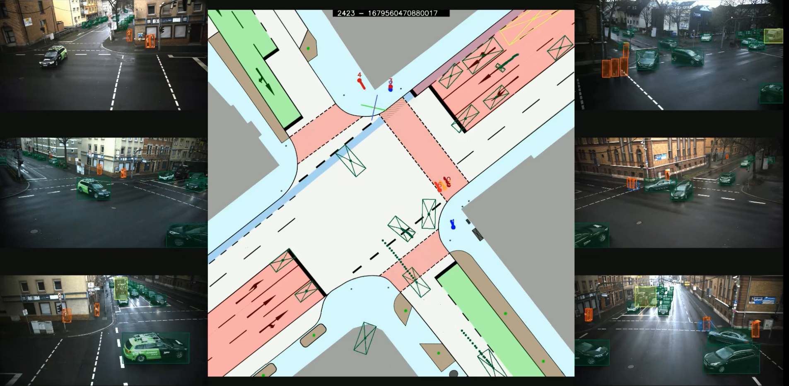
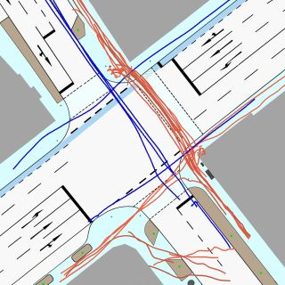
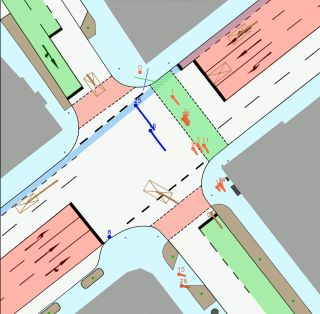
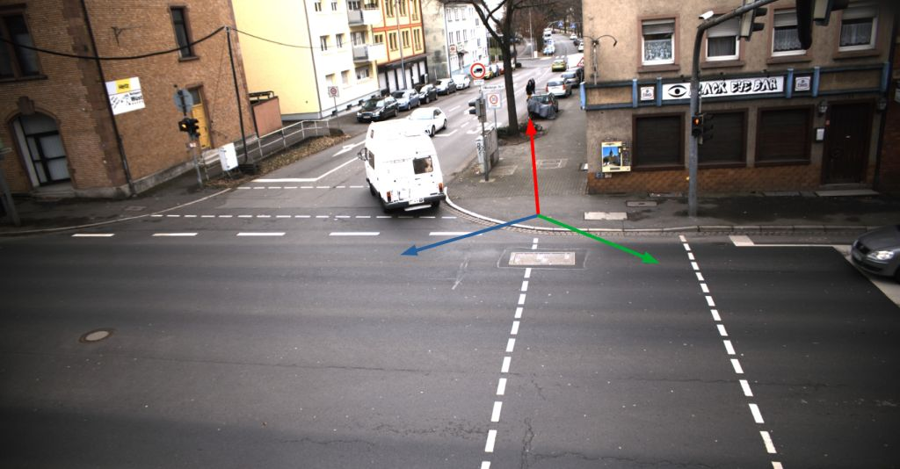
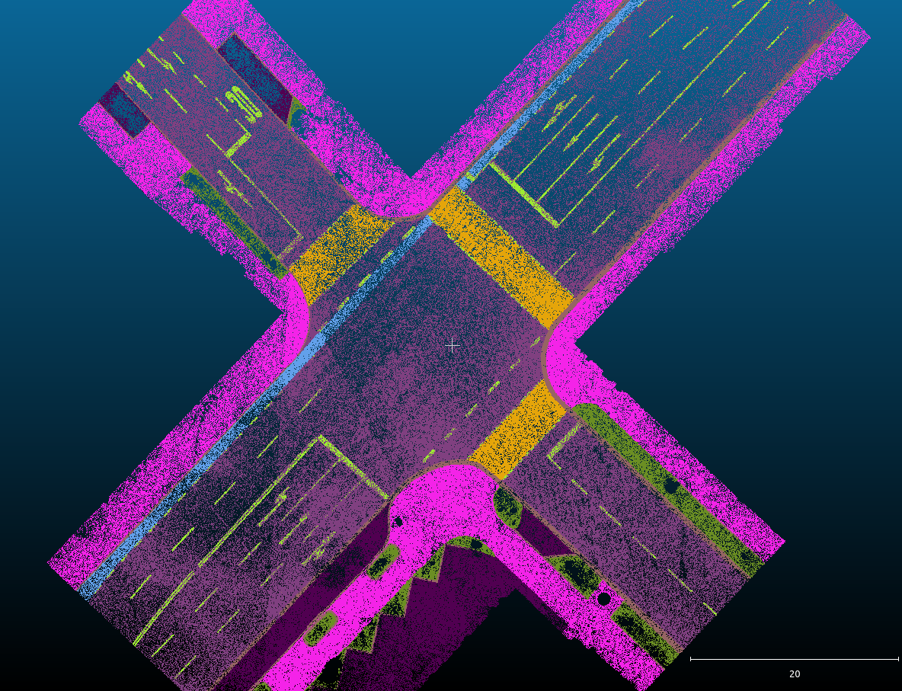
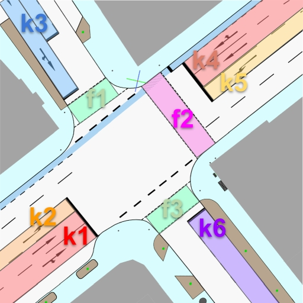

### The IMPTC Dataset: An Infrastructural Multi-Person Trajectory and Context Dataset



#### Paper:
**_M. Hetzel, H. Reichert, G. Reitberger, K. Doll, E. Fuchs, and B. Sick "The IMPTC Dataset: An Infrastructural Multi-Person Trajectory and Context Dataset", IV 2023, Anchorage USA._**

**Links:**
 - IEEE Explore: [[click here]](https://ieeexplore.ieee.org/document/10186776)
 - ResearchGate: [[click here]](https://www.researchgate.net/publication/372697121_The_IMPTC_Dataset_An_Infrastructural_Multi-Person_Trajectory_and_Context_Dataset)
 - ArXiv: [[click here]](https://arxiv.org/abs/2307.06165)

#### Citation:
If you use our dataset, please cite:
```
@INPROCEEDINGS{10186776,
  author={Hetzel, Manuel and Reichert, Hannes and Reitberger, Günther and Fuchs, Erich and Doll, Konrad and Sick, Bernhard},
  booktitle={2023 IEEE Intelligent Vehicles Symposium (IV)}, 
  title={The IMPTC Dataset: An Infrastructural Multi-Person Trajectory and Context Dataset}, 
  year={2023},
  volume={},
  number={},
  pages={1-7},
  doi={10.1109/IV55152.2023.10186776}}
}
```
---
### Table of contents:
* [Overview](#overview)
* [Samples](#samples)
* [Download](#download)
* [The Dataset](#dataset)
* [Data Structure](#data_structure)
* [License](#license)

---
<a name="overview"></a>
### Overview

This repository contains all information for the IMPTC Dataset, including data specifications, overviews, sample data, and download links. The dataset consists of two different subtypes with different research targets. The sequence focused dataset targets scene understanding and interaction/social-based trajectory forecasting topics. The VRU trajectory focused dataset targets classical single VRU trajectory forecasting research.

##### Sequence focused 
The data is split into single, fully synchronized, independent, and unaffected sequences. The sequences are recorded on everyday public road traffic at different times, seasons, and weather conditions using a combination of LiDAR and camera sensors operating at 25 Hz. The dataset provides high-quality VRU and vehicle trajectories and additional context information like weather data, traffic light signal status, a segmentation map, a sequence overview video, and more. The sequence-focused data consists of 270 sequences, including 2700+ VRU trajectories with an average duration of 32 seconds and 14600+ vehicle trajectories.

##### VRU Trajectory focused
The trajectory-only dataset consists of the classical train, eval, and test split. The dataset consists of 5133 VRU trajectories splitted into: 3585 train, 400 eval, and 1148 test trajectories. Train and eval sets are extracted from the 270 above-described sequences and from a additional set of non-publically released data. The separate test set is extracted from closed, non-publically released sequences.

---
### Sequence Overview
A quick overview of all released sequences can be found here: [[IMPTC Sequence Summary]](https://docs.google.com/spreadsheets/d/1XliLCHTzBK3iBGoCy0jCPyb7eP1C2ZV45Da6Pznw524/edit?usp=sharing)

---
<a name="samples"></a>
### Samples
The sample package consists of four complete sequences. A demo video of one of the four sample sequences can be found below. The samples can be downloaded here:

**Watch Sequence Overview Video:** [[click here]](https://drive.google.com/file/d/1tAPL-fh3EjeYRfe1KNB-tAkhqm6-BDWv/view?usp=drive_link)

| Sample Data | [Download](https://drive.google.com/file/d/1UvcO5jPRRsbtriFRB1HlZpPtxRqjOM66/view?usp=sharing) | $${\color{green}Online}$$    | 0.3 GB   |
|:---------:|:-------------:|:---------:|:------:|

**Description:** A sequence with many pedestrians and cyclists crossing the intersection in multiple directions. Sequence duration is 121 seconds and includes 30 VRU and 72 vehicle tracks.
 


---
<a name="download"></a>
## Downloads
#### Full Sequence Dataset
The full sequenced dataset is split into five chunks of 50+ sequences each. It contains all data synchronized by reference timestamps. The data structure is explained in the chapter 'Data Structure'. The chunks can be downloaded here:

| Sequences | Download Link | Status    | Size   |
|:---------:|:-------------:|:---------:|:------:|
| 00-49      | [[Set_01]](https://drive.google.com/file/d/1HY0PkAwEnBLZRL1_-m4tZtezJxW2Pu5Y/view?usp=sharing)           | $${\color{green}Online}$$ |  2.5 GB  |
| 50-99     | [[Set_02]](https://drive.google.com/file/d/1Uvms0DD5SUiGKAVgz6WQZWCwCnaOdUBd/view?usp=sharing)           | $${\color{green}Online}$$ |  2.3 GB  |
| 100-149   | [[Set_03]](https://drive.google.com/file/d/1NCZUqW2fK_KbSXm5WmqVzJTUZ0MpaTfB/view?usp=sharing)           | $${\color{green}Online}$$ |  2.7 GB  |
| 150-199   | [[Set_04]](https://drive.google.com/file/d/1THOMJfNVc-60puyo2K1wPPZTaUzna-qL/view?usp=sharing)           | $${\color{green}Online}$$ |  3.3 GB  |
| 200-269   | [[Set_05]](https://drive.google.com/file/d/1dji-KepI_AOYteRNAh7AzUb3XDWAUgPn/view?usp=sharing)           | $${\color{green}Online}$$ |  4.8 GB  |


#### VRU Trajectory Dataset
The VRU trajectory data, split into train, eval, and test, can be downloaded here:

| VRU Trajectory Dataset | [Download](https://drive.google.com/file/d/19co_aq7UT7lWMZjoK5si5rY_HC2MFZea/view?usp=sharing) | $${\color{green}Online}$$    | 2.7 GB   |
|:---------:|:-------------:|:---------:|:------:|

---

<a name="dataset"></a>
### The VRU Trajectory Dataset

Train and eval sets are extracted from the 270 released sequences and from a additional set of non-publically released data. The separate test set is extracted from closed, non-publically released sequences.


| VRU class | Train | Eval | Test |
|:----:|:-----------:|:----:|:-----------:|
| pedestrian | 2628 | 310 | 843 |
| cyclist | 617 | 58 | 179 |
| motorcycle | 233 | 22 | 103 |
| scooter | 85 | 9 | 14 |
| stroller | 22 | 1 | 9 |
| wheelchair | 0 | 0 | 0|
| **Total** | **3585** | **400** | **1148** |

### The Sequence Dataset
The dataset consists of 270 unaffected sequences recorded on everyday public road traffic. The sequences are recorded at different times of the day, seasons, and weather conditions using a combination of LiDAR and camera sensors operating at 25 Hz. The dataset provides high-quality VRU and vehicle trajectories and additional context information like weather data, traffic light signal status, a segmentation map, a sequence overview video, and more.


#### Object types
A detailed description of the vru and vehicle data formats can be found here: [[vru specification]](data_formats/vru_tracks.md), [[vehicle specification]](data_formats/vehicle_tracks.md). In total, the dataset covers eight different classes of road users. The total amount of each object class is listed below:

| VRU class | Number of tracks |
|:----:|:-----------:|
| pedestrian | 1920 |
| cyclist | 503 |
| motorcycle | 203 |
| scooter | 80 |
| stroller | 17 |
| wheelchair | 0 |
| **Total** | **2723** |


| Vehicle class | Number of tracks |
|:----:|:-----------:|
| truck/bus | 447 |
| car | 14190 |
| **Total** | **14637** |

---
#### Context types

```md
### Context types:
- Weather data
- Traffic light signal status
- Ground classification / Segmentation map
- OSM Reference map
- GPS Timestamp data synchronisation
- Overview video 
```

---
#### Coordinate System
The dataset uses its own 3D world coordinate system. All tracks refer to this coordinate system and use the meter (m) as a unit. The locally used coordinate system can be converted to global UTM (Zone 32) by applying the following shift:

```
### Conversion to UTM (Zone 32)
|       |     X     |     Y      |   Z    |
| local |    0.0    |     0.0    |   0.0  |
| gobal | 511570.38 | 5535358.32 | 150.22 |
```

Its origin position is located at one of the four sidewalk edges and marked on the top view map by a small red dot with a green and blue line. The lines indicate the X- and Y-axis, with the blue line representing the X-axis pointing towards the eastern direction and the green line representing the Y-axis pointing towards the northern direction. The Z-axis, in red, points towards the sky, with ground level representing zero height. The following image illustrates the location and directions.



###### Altitude gradient
The complete intersection area has a steady altitude gradient of 4-5%. In some cases, this can affect height measurements.

---
#### Ground Classification / Segmentation Map
The following eight different ground types are included within the intersection area. A detailed description of the data format can be found here: [[segmentation map specification]](data_formats/ground_plane.md). 

**The map can be downloaded here:** [[Segmentation Map]](https://drive.google.com/file/d/1uPcvJv-etmImUCoVugBAJUJmFrLcd5kR/view?usp=sharing)

```md
### Ground segmentation types
- Road
- Sidewalk
- Crosswalk
- Bikelane
- Curb
- Road Line
- Undefined Ground
- Unknown
```



---
#### Timestamp Master
A detailed description of the data format can be found here: [[timestamp specification]](data_formats/timestamp_master.md). This file includes all GPS timestamps within the sequence for data synchronization. All context and track data are derived from this master. The system operates at a frequency of 25 Hz.

---
#### Weather Data
A detailed description of the data format can be found here: [[weather data specification]](data_formats/weather_data.md). The data refreshing rate is one new data per 10 seconds (0.1 Hz). In total, five weather classes and six weather describing parameters are included and listed below:

```md
### Classes:
- Sunny/Cloudy
- Light rainfall
- Strong rainfall
- Snowy
- Foggy 

### Parameters:
- Temperatur
- Precipitation Type
- Precipitation Amount
- Wind Direction
- Wind Force
- Visibility
```

---
#### Traffic Light Signal Data
A detailed description of the data format can be found here: [[traffic light specification]](data_formats/traffic_light_data.md). The data refreshing rate is 1 Hz. In total, nine traffic light signal groups are tracked and represented by the following six different light states:

```md
### Light states:
- Off
- Red
- Red-yellow
- Yellow
- Green
- Yellow-Blinking
```

##### Signal groups
The nine signal groups are illustrated below. The groups k1 till k6 represent the different vehicle lanes and driving directions. The groups f1 till f3 represent the three signalized pedestrian crossings.



---
<a name="data_structure"></a>
### Data Structure
#### For a sequence
The data structure for a sequence is always the same and is described by the following schematic overview:

```md
sequence id
├── context
│   ├── master_timestamp_sync.json
│   ├── traffic_light_signals.json
│   ├── weather_data.json
│
├── vehicles
│   ├── track id 1000
│       ├── summary.png
│       ├── topview.png
│       ├── track.json
│   ├── track id 1001
│       ├── summary.png
│       ├── topview.png
│       ├── track.json
│   ├── track id ...
│
├── vrus
│   ├── track id 000
│       ├── summary.png
│       ├── topview.png
│       ├── track.json
│   ├── track id 001
│       ├── summary.png
│       ├── topview.png
│       ├── track.json
│   ├── track id ...
│
├── overview.csv
├── sequence_overview_map.jpg
├── sequence_overview.video.mp4
├── sequence_tracks_video.mp4
├── vehicle_trackinfo.csv
└── vru_trackinfo.csv
```

---
#### VRU trajectory data:
Each trajectory within a set is stored within a separate subfolder defined by the trajectories ID. It contains the singles track data and an overview top view image for visualization. In addition, all trajectories of a set are combined within the train/eval/test_tracks.json file for easy loading.

```md
├── test
│   ├── 0000
│       ├── 0000_topview.png
│       ├── track.json
│       ├── src_info.txt
│   ├── 0001
│       ├── 0001_topview.png
│       ├── track.json
│       ├── src_info.txt
│   ├── ...
│       ├── ...
│       ├── ...
│       ├── ...
│
├── eval
│   ├── 0000
│   ├── ...
│
├── train
│   ├── 0000
│   ├── ...
│
├── test_tracks.json
├── test_tracks.jpg
├── test_overview.csv
├── eval_tracks.json
├── eval_tracks.jpg
├── eval_overview.csv
├── train_tracks.json
├── train_tracks.jpg
├── train_overview.csv
```

---
#### Context files

The context data from the weather sensors, traffic light signal logger, and GPS Timestamp synchronization are located here. The following table gives an overview: 

| File | Description |
|:----:|:-----------:|
| master_timestamp_sync.json | Master timestamp data for sequence data synchonization |
| traffic_light_signals.json | Traffic light signal status data |
| weather_data.json | Weather sensor data |

---
#### Track files

Every single track is numbered by a unique id within the sequence. VRUs always start with **_ID: 000_**. Vehicles start with **_ID: 1000_**. Every track data is located within its own subfolder containing the track data:

| File | Description |
|:----:|:-----------:|
| track.json | Track data|
| topview.png | Topview visualization of the tracks movement |
| summary.png | Plot with visualization of track data like velocity and more|

---
#### Additional files

Every scene contains additional supporting files to understand better what is going on and what is included within the sequence. The following table gives an overview: 

| File | Description |
|:----:|:-----------:|
| overview.csv | Lists the total number of included tracks and subclasses |
| sequence_overview_map.jpg | Topview map illustrating all VRU tracks from their start to end |
| sequence_overview.video.mp4 | Full Sequence overview video including all data and camera perspektives |
| sequence_tracks_video.mp4 |  Full Sequence overview video including all tracks |
| vehicle_trackinfo.csv | Lists the total number of vehicle tracks by ID and track length |
| vru_trackinfo.csv | Lists the total number of VRU tracks by ID and track length |

---
<a name="license"></a>
## License:
This project is licensed under the Apache 2.0 License - see the [LICENSE](LICENSE) file for details

---
