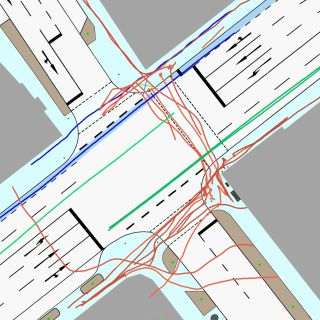

### The IMPTC Dataset: An Infrastructural Multi-Person Trajectory and Context Dataset


#### Paper:
**_M. Hetzel, H. Reichert, G. Reitberger, K. Doll, E. Fuchs, and B. Sick "The IMPTC Dataset: An Infrastructural Multi-Person Trajectory and Context Dataset", IV 2023, Anchorage USA._**

**Links:**
 - IEEE Explore: [[click here]](https://ieeexplore.ieee.org/document/10186776)
 - ResearchGate: [[click here]](https://www.researchgate.net/publication/372697121_The_IMPTC_Dataset_An_Infrastructural_Multi-Person_Trajectory_and_Context_Dataset)
 - ArXiv: [[click here]](https://arxiv.org/abs/2307.06165)

#### Citation:
If you use our dataset, please cite:
```
@INPROCEEDINGS{10186776,
  author={Hetzel, Manuel and Reichert, Hannes and Reitberger, Günther and Fuchs, Erich and Doll, Konrad and Sick, Bernhard},
  booktitle={2023 IEEE Intelligent Vehicles Symposium (IV)}, 
  title={The IMPTC Dataset: An Infrastructural Multi-Person Trajectory and Context Dataset}, 
  year={2023},
  volume={},
  number={},
  pages={1-7},
  doi={10.1109/IV55152.2023.10186776}}
}
```
---
### Table of contents:
* [Overview](#overview)
* [Samples](#samples)
* [Download](#download)
* [The Dataset](#dataset)
* [Data Structure](#data_structure)
* [License](#license)

---
<a name="overview"></a>
## Overview:

This repository contains all information for the IMPTC Dataset inlcuding data specifications, overviews, sample data and download links. The data availability is a continous process for the rest of the year. New sequences will be added every month, starting with the first batch at the end of august. Therefore this site will be updated regularly. In order to achieve a consistent data basis and comparability, the first 250 sequences will be standardized as version 1.0.

---
#### Release Schedule:
##### 08. August 2023:
Sample sequences will be available. 

##### 31. August 2023:
First set of 50 sequences will be available.

##### 30. September 2023:
Second set of 50  sequences will be available.

---
## Sequence Overview:
A quick overview of all released sequences can be found here: [[IMPTC Sequence Summary]](https://docs.google.com/spreadsheets/d/1DnTD0kH1Js1pAnzpig57MruFz5zqqvhHPJqgNz5Q8Qo/edit?usp=sharing)

---
<a name="samples"></a>
## Samples:

#### Sample 01:

 
**Description:** A sequence with many pedestrians crossing the intersection in multiple directions. Sequence duration is 120 seconds and includes 29 VRU and 87 vehicle tracks.

**Download Data:** [[click here]](https://drive.google.com/file/d/1M1ZfFsAtAlV2BmrWNCWBPb0zwV0hFw2y/view?usp=sharing)
**Watch Sequence Overview Video:** [[click here]](https://drive.google.com/file/d/1i_-SuRKNocA5lxiMas875Jg0wlALDq1B/view?usp=sharing)

---
#### Sample 02:

 
**Description:** A sequence with many pedestrians and cyclists crossing the intersection in multiple directions. Sequence duration is 121 seconds and includes 31 VRU and 72 vehicle tracks.

**Download Data:** [[click here]](https://drive.google.com/file/d/1ymzK-U44h9inUxJb5AEM2zM-mndQA0S5/view?usp=sharing)
**Watch Sequence Overview Video:** [[click here]](https://drive.google.com/file/d/1QThVRhvwPUb8REpzJ2otufKxpE6szXxK/view?usp=sharing)

---
#### Sample 03:

 
 **Description:** A sequence with a few VRUs (3 Pedestrians, 1 Cyclist and 1 E-Scooter driver) crossing the intersection. Sequence duration is 89 seconds and includes 5 VRU and 58 vehicle tracks.

 **Download Data:** [[click here]](https://drive.google.com/file/d/1u005DIL8YqyD6Cn2k-P4xluvvNphkWRZ/view?usp=sharing)
**Watch Sequence Overview Video:** [[click here]](https://drive.google.com/file/d/1M7Kq3cD354_ip82IdoKPE1_zRB8j5DRs/view?usp=sharing)

---
<a name="download"></a>
## Download:
All packages are split into compressed 1GB chunks.

Coming soon!

| Sequences | Download Link | Status    | Size   |
|:---------:|:-------------:|:---------:|:------:|
| 1-50      | ...           | `offline` |  0 GB  |
| 51-100    | ...           | `offline` |  0 GB  |
| 101-150   | ...           | `offline` |  0 GB  |
| 151-200   | ...           | `offline` |  0 GB  |
| 201-250   | ...           | `offline` |  0 GB  |

---
<a name="dataset"></a>
## The Dataset:
The dataset consists of 250 unaffected sequences recorded on everyday public road traffic. The sequences are recorded at different daytimes, seasons and weather conditions using a combination of LiDAR and camera sensors. The dataset provides high quality VRU and vehicle trajectories as well as additional context information like weather data, traffic light signal status, a OSM-Reference map, a sequence overview video and more.

#### Object types:
A detailed description of the vru and vehicle data formats can be found here: [[vru specification]](data_formats/vru_tracks.md), [[vehicle specification]](data_formats/vehicle_tracks.md). In total the dataset covers nine different classes of road users listed below:

```md
- Pedestrian
- Cyclist
- Motorcyclist
- (E)-Scooter driver
- Wheelchair driver
- Pedestrian with stroller
- Car
- Truck
- Unknown object
```

#### Context types:

```md
- Weather data
- Traffic light signal status
- Ground classification
- OSM Reference map
- GPS Timestamp data synchronisation
- Overview video 
```

#### Ground Classification:
The following seven different ground types are included within the intersection area.

```md
- Road
- Bicycle Lane
- Sidewalk
- Crossing
- Curb
- Road Line
- Undefined Ground
```

#### Timestamp Master:
A detailed description of the data format can be found here: [[timestamp specification]](data_formats/timestamp_master.md). This file includes all GPS timestamps within the sequence for data synchronization. All context and track data are derived from this master. The system operates at a frequency of 25 Hz.

#### Weather Data:
A detailed description of the data format can be found here: [[weather data specification]](data_formats/weather_data.md). The data refreshing rate is one new data per 10 seconds (0.1 Hz). In total five weather classes and six weather describing parameters are included and listed below:

```md
# Classes:
- Sunny/Cloudy
- Light rainfall
- Strong rainfall
- Snowy
- Foggy 

# Parameters:
- Temperatur
- Precipitation Type
- Precipitation Amount
- Wind Direction
- Wind Force
- Visibility
```

#### Traffic Light Signal Data:
A detailed description of the data format can be found here: [[traffic light specification]](data_formats/traffic_light_data.md). The data refreshing rate is 1 Hz. In total nine traffic light signal groups are tracked and represented by the following six different light states:

```md
# Light states:
- Off
- Red
- Red-yellow
- Yellow
- Green
- Yellow-Blinking
```

##### Signal groups:
The nine signal groups are illustrated below. The groups k1 till k6 represent the different vehicle lanes and driving directions. The groups f1 till f3 represent the three signalized pedestrians crossings.


---
<a name="data_structure"></a>
## Data Structure:
The data structure for a sequence is always the same and is described by the following scemantic overview:

```md
sequence id
├── context
│   ├── master_timestamp_sync.json
│   ├── traffic_light_signals.json
│   ├── weather_data.json
│
├── vehicles
│   ├── track id 1000
│       ├── summary.png
│       ├── topview.png
│       ├── track.json
│   ├── track id 1001
│       ├── summary.png
│       ├── topview.png
│       ├── track.json
│   ├── track id ...
│
├── vrus
│   ├── track id 000
│       ├── summary.png
│       ├── topview.png
│       ├── track.json
│   ├── track id 001
│       ├── summary.png
│       ├── topview.png
│       ├── track.json
│   ├── track id ...
│
├── overview.csv
├── sequence_overview_map.jpg
├── sequence_overview.video.mp4
├── sequence_tracks_video.mp4
├── vehicle_trackinfo.csv
└── vru_trackinfo.csv
```
**Context files:**
The context data from the weather sensors, traffic light signal logger, and GPS Timestamp synchronization are located here. The following table gives an overview: 

| File | Description |
|:----:|:-----------:|
| track.json | Track data|
| topview.png | Topview visualization of the tracks movement |
| summary.png | Plot with visualization of track data like velocity and more|


**Track files:**
Every single track is numbered by a unique id within the sequence. Pedestrians always start with **_ID: 000_**. Vehicles start with **_ID: 1000_**. Every tracks data is located within its own subfolder containing the track data:

| File | Description |
|:----:|:-----------:|
| track.json | Track data|
| topview.png | Topview visualization of the tracks movement |
| summary.png | Plot with visualization of track data like velocity and more|


**Additional files:**
Every scene contains multiple additional supporting files for better scene understanding of whats going on and whats included within the sequence. The following table gives an overview: 
| File | Description |
|:----:|:-----------:|
| overview.csv | Lists the total number of included tracks and subclasses |
| sequence_overview_map.jpg | Topview map illustrating all VRU tracks from their start to end |
| sequence_overview.video.mp4 | Full Sequence overview video including all data and camera perspektives |
| sequence_tracks_video.mp4 |  Full Sequence overview video including all tracks |
| vehicle_trackinfo.csv | Lists the total number of vehicle tracks by ID and track length |
| vru_trackinfo.csv | Lists the total number of VRU tracks by ID and track length |

---
<a name="license"></a>
## License:
This project is licensed under the Apache 2.0 License - see the [LICENSE](LICENSE) file for details

---