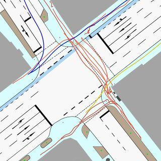
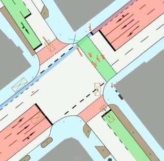

### The IMPTC Dataset: An Infrastructural Multi-Person Trajectory and Context Dataset


#### Paper:
**_M. Hetzel, H. Reichert, G. Reitberger, K. Doll, E. Fuchs, and B. Sick "The IMPTC Dataset: An Infrastructural Multi-Person Trajectory and Context Dataset", IV 2023, Anchorage USA._**

**Links:**
 - IEEE Explore: [[click here]](https://ieeexplore.ieee.org/document/10186776)
 - ResearchGate: [[click here]](https://www.researchgate.net/publication/372697121_The_IMPTC_Dataset_An_Infrastructural_Multi-Person_Trajectory_and_Context_Dataset)
 - ArXiv: [[click here]](https://arxiv.org/abs/2307.06165)

#### Citation:
If you use our dataset, please cite:
```
@INPROCEEDINGS{10186776,
  author={Hetzel, Manuel and Reichert, Hannes and Reitberger, Günther and Fuchs, Erich and Doll, Konrad and Sick, Bernhard},
  booktitle={2023 IEEE Intelligent Vehicles Symposium (IV)}, 
  title={The IMPTC Dataset: An Infrastructural Multi-Person Trajectory and Context Dataset}, 
  year={2023},
  volume={},
  number={},
  pages={1-7},
  doi={10.1109/IV55152.2023.10186776}}
}
```
---
### Table of contents:
* [Overview](#overview)
* [Samples](#samples)
* [Download](#download)
* [The Dataset](#dataset)
* [Data Structure](#data_structure)
* [License](#license)

---
<a name="overview"></a>
## Overview:

This repository contains all information for the IMPTC Dataset inlcuding data specifications, overviews, sample data and download links. The data availability is a continous process for the rest of the year 2023. New sequences will be added every month, starting with the first batch at the end of august 2023. Therefore this site will be updated regularly. The data is provided in a per sequence style (including context and synchronization) or in a classical trajectory focused style (only vru trajectories, with defined seperate train, eval and test splits).
In order to achieve a consistent data basis and comparability, the first 250 sequences will be standardized as version 1.0.

---
#### Release Schedule:
##### 08. August 2023:
Sample sequences are available. 

##### 31. August 2023:
First set of 50 sequences is available.

##### 05. September 2023:
Second set of 50 sequences is available.

##### 14. September 2023:
Third set of 50 sequences is available.

##### 26. Oktober 2023:
Fourth set of 50 sequences is available.

##### 03. November 2023:
An additional data representation in the classical trajectory focused style is available (only vru trajectories, with defined seperate train, eval and test splits).
**Note:** train_set_05 and eval_set are currently missing and will be added later!

---
## Sequence Overview:
A quick overview of all released sequences can be found here: [[IMPTC Sequence Summary]](https://docs.google.com/spreadsheets/d/1XliLCHTzBK3iBGoCy0jCPyb7eP1C2ZV45Da6Pznw524/edit?usp=sharing)

---
<a name="samples"></a>
## Samples:

#### Sample 01:

 

**Description:** A sequence with many pedestrians crossing the intersection in multiple directions. Sequence duration is 120 seconds and includes 29 VRU and 87 vehicle tracks.

**Watch Sequence Overview Video:** [[click here]](https://drive.google.com/file/d/1jc3lwiPgsW3wIY3SmN1w5ZX1icYOw7Y9/view?usp=drive_link)

---
#### Sample 02:

 

**Description:** A sequence with many pedestrians and cyclists crossing the intersection in multiple directions. Sequence duration is 121 seconds and includes 30 VRU and 72 vehicle tracks.

**Watch Sequence Overview Video:** [[click here]](https://drive.google.com/file/d/1tAPL-fh3EjeYRfe1KNB-tAkhqm6-BDWv/view?usp=drive_link)

---
#### Sample 03:

 

 **Description:** A sequence with a few VRUs (3 Pedestrians, 1 Cyclist and 1 E-Scooter driver) crossing the intersection. Sequence duration is 89 seconds and includes 5 VRU and 58 vehicle tracks.
 
**Watch Sequence Overview Video:** [[click here]](https://drive.google.com/file/d/1qIMXhGBaHWhmhBaK2nkHXb8eYAriO808/view?usp=drive_link)

---
#### Sample 04:

 

 **Description:** A sequence with many VRUs crossing the intersection. Sequence duration is 109 seconds and includes 17 VRU and 73 vehicle tracks.
 
**Watch Sequence Overview Video:** [[click here]](https://drive.google.com/file/d/17oRJvW1As7Zd_chlBKH4qi9OOebaAK5m/view?usp=drive_link)

---
<a name="download"></a>
## Download:
#### Sample Data: 
Four sample sequences are available. Descriptions and demo videos can be found above. The samples can be downloaded here:

| Sample Data | [Download](https://drive.google.com/file/d/1vLjuHa2hsJEODjTz7StUylNg2zDMdphR/view?usp=drive_link) | $${\color{green}Online}$$    | 0.3 GB   |
|:---------:|:-------------:|:---------:|:------:|

```
```

#### Full Dataset:
The full dataset is splitted into five chuncks of 50 sequences each. It containes all data, synchronized by reference timestamps. The data strucutre is explained in the chapter 'Data Structure'. The chunks can be downloaded here:

| Sequences | Download Link | Status    | Size   |
|:---------:|:-------------:|:---------:|:------:|
| 1-50      | [[Set_01]](https://drive.google.com/file/d/1HY0PkAwEnBLZRL1_-m4tZtezJxW2Pu5Y/view?usp=sharing)           | $${\color{green}Online}$$ |  2.5 GB  |
| 51-100    | [[Set_02]](https://drive.google.com/file/d/1Uvms0DD5SUiGKAVgz6WQZWCwCnaOdUBd/view?usp=sharing)           | $${\color{green}Online}$$ |  2.3 GB  |
| 101-150   | [[Set_03]](https://drive.google.com/file/d/1NCZUqW2fK_KbSXm5WmqVzJTUZ0MpaTfB/view?usp=sharing)           | $${\color{green}Online}$$ |  2.7 GB  |
| 151-200   | [[Set_04]](https://drive.google.com/file/d/1THOMJfNVc-60puyo2K1wPPZTaUzna-qL/view?usp=sharing)           | $${\color{green}Online}$$ |  3.3 GB  |
| 201-250   | [[Set_05]]()           | $${\color{red}tba}$$  |  0.0 GB  |

```
```

#### VRU Trajectory Data:
The VRU trajectory data can be downloaded separatly for itself. The above mentioned five dataset chuncks represent the train batches. In addition a seperate evaluation and a test set are included. The VRU trajectory data can be downloaded here:

| VRU Trajectory Data | [Download](https://drive.google.com/file/d/1LyWpQaAQCAiOdFmx1C2FYSp3idsLcSkh/view?usp=sharing) | $${\color{green}Online}$$    | 1.4 GB   |
|:---------:|:-------------:|:---------:|:------:|

---

<a name="dataset"></a>
## The Dataset:
The dataset consists of 250 unaffected sequences recorded on everyday public road traffic. The sequences are recorded at different daytimes, seasons and weather conditions using a combination of LiDAR and camera sensors. The dataset provides high quality VRU and vehicle trajectories as well as additional context information like weather data, traffic light signal status, a segmentation map, a sequence overview video and more. The data is provided in a per sequence style (including context and synchronization) or in a classical trajectory focused style (only vru trajectories, with defined seperate train, eval and test splits).

#### Object types:
A detailed description of the vru and vehicle data formats can be found here: [[vru specification]](data_formats/vru_tracks.md), [[vehicle specification]](data_formats/vehicle_tracks.md). In total the dataset covers nine different classes of road users listed below:

```md
- Pedestrian
- Cyclist
- Motorcyclist
- (E)-Scooter driver
- Wheelchair driver
- Pedestrian with stroller
- Car
- Truck
- Unknown object
```

#### Context types:

```md
- Weather data
- Traffic light signal status
- Ground classification / Segmentation map
- OSM Reference map
- GPS Timestamp data synchronisation
- Overview video 
```

#### Coordinate System:
The dataset uses its own 3D world coordinate system. All tracks refer to this coordinate system and use meter (m) as unit. The local used coordinate system can be converted to global UTM (Zone 32) by applying the following shift:

```
# Conversion to UTM (Zone 32)
|       |     X     |     Y      |   Z    |
| local |    0.0    |     0.0    |   0.0  |
| gobal | 511570.38 | 5535358.32 | 150.22 |
```

Its origin position is located at one of the four sidewalk egdes and marked on the topview map by a small red dot with a green and blue line. The lines indicate the X- and Y- axes, with the blue line representing the X-axis pointing towards eastern direction and the green line representing the Y-axis pointing towards northern direction. The Z-axis, in red, points towards the sky, with ground level representing zero height. The following image illustrates location and directions.


###### Altitude gradient:
The complete intersection area has a steady altitude gradient of 4-5%. In some cases this can affect height measurements.

#### Ground Classification / Segmentation Map:
The following eight different ground types are included within the intersection area. A detailed description of the data format can be found here: [[segmentation map specification]](data_formats/ground_plane.md). 

**The map can be downloaded here:** [[Segmentation Map]](https://drive.google.com/file/d/1uPcvJv-etmImUCoVugBAJUJmFrLcd5kR/view?usp=sharing)

```md
- Road
- Sidewalk
- Crosswalk
- Bikelane
- Curb
- Road Line
- Undefined Ground
- Unknown
```


#### Timestamp Master:
A detailed description of the data format can be found here: [[timestamp specification]](data_formats/timestamp_master.md). This file includes all GPS timestamps within the sequence for data synchronization. All context and track data are derived from this master. The system operates at a frequency of 25 Hz.

#### Weather Data:
A detailed description of the data format can be found here: [[weather data specification]](data_formats/weather_data.md). The data refreshing rate is one new data per 10 seconds (0.1 Hz). In total five weather classes and six weather describing parameters are included and listed below:

```md
# Classes:
- Sunny/Cloudy
- Light rainfall
- Strong rainfall
- Snowy
- Foggy 

# Parameters:
- Temperatur
- Precipitation Type
- Precipitation Amount
- Wind Direction
- Wind Force
- Visibility
```

#### Traffic Light Signal Data:
A detailed description of the data format can be found here: [[traffic light specification]](data_formats/traffic_light_data.md). The data refreshing rate is 1 Hz. In total nine traffic light signal groups are tracked and represented by the following six different light states:

```md
# Light states:
- Off
- Red
- Red-yellow
- Yellow
- Green
- Yellow-Blinking
```

##### Signal groups:
The nine signal groups are illustrated below. The groups k1 till k6 represent the different vehicle lanes and driving directions. The groups f1 till f3 represent the three signalized pedestrians crossings.


---
<a name="data_structure"></a>
## Data Structure:
**The data structure for a sequence** is always the same and is described by the following scemantic overview:

```md
sequence id
├── context
│   ├── master_timestamp_sync.json
│   ├── traffic_light_signals.json
│   ├── weather_data.json
│
├── vehicles
│   ├── track id 1000
│       ├── summary.png
│       ├── topview.png
│       ├── track.json
│   ├── track id 1001
│       ├── summary.png
│       ├── topview.png
│       ├── track.json
│   ├── track id ...
│
├── vrus
│   ├── track id 000
│       ├── summary.png
│       ├── topview.png
│       ├── track.json
│   ├── track id 001
│       ├── summary.png
│       ├── topview.png
│       ├── track.json
│   ├── track id ...
│
├── overview.csv
├── sequence_overview_map.jpg
├── sequence_overview.video.mp4
├── sequence_tracks_video.mp4
├── vehicle_trackinfo.csv
└── vru_trackinfo.csv
```

**The data structure for the only vru trajectory data path** is always the same. Each trajectory within a set is stored within a seperate subfolder defined by the trajectories id. It containes the singles track data and an overview topview image for visualization. In addition all trajectories of a set are combined within the xy_set_tracks.json file for easy loading.

 and is described by the following scemantic overview:

```md
├── test_set
│   ├── 0000
│       ├── 0000_topview.png
│       ├── track.json
│       ├── src_info.txt
│   ├── 0001
│       ├── 0001_topview.png
│       ├── track.json
│       ├── src_info.txt
│   ├── ...
│       ├── ...
│       ├── ...
│       ├── ...
│   ├── test_set_tracks.json
│   ├── test_set_tracks.jpg
│   ├── test_set_overview.csv
│
├── eval_set
├── train_set_01
├── train_set_02
├── train_set_03
├── train_set_04
├── train_set_05
```

**Context files:**

The context data from the weather sensors, traffic light signal logger, and GPS Timestamp synchronization are located here. The following table gives an overview: 

| File | Description |
|:----:|:-----------:|
| track.json | Track data|
| topview.png | Topview visualization of the tracks movement |
| summary.png | Plot with visualization of track data like velocity and more|


**Track files:**

Every single track is numbered by a unique id within the sequence. VRUs always start with **_ID: 000_**. Vehicles start with **_ID: 1000_**. Every tracks data is located within its own subfolder containing the track data:

| File | Description |
|:----:|:-----------:|
| track.json | Track data|
| topview.png | Topview visualization of the tracks movement |
| summary.png | Plot with visualization of track data like velocity and more|


**Additional files:**

Every scene contains multiple additional supporting files for better scene understanding of whats going on and whats included within the sequence. The following table gives an overview: 
| File | Description |
|:----:|:-----------:|
| overview.csv | Lists the total number of included tracks and subclasses |
| sequence_overview_map.jpg | Topview map illustrating all VRU tracks from their start to end |
| sequence_overview.video.mp4 | Full Sequence overview video including all data and camera perspektives |
| sequence_tracks_video.mp4 |  Full Sequence overview video including all tracks |
| vehicle_trackinfo.csv | Lists the total number of vehicle tracks by ID and track length |
| vru_trackinfo.csv | Lists the total number of VRU tracks by ID and track length |

---
<a name="license"></a>
## License:
This project is licensed under the Apache 2.0 License - see the [LICENSE](LICENSE) file for details

---
