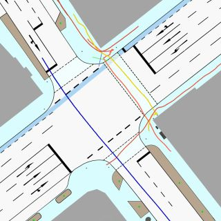

### The IMPTC Dataset: An Infrastructural Multi-Person Trajectory and Context Dataset


##### This repository contains all information for the IMPTC Dataset:
[**M. Hetzel, H. Reichert, G. Reitberger, K. Doll, E. Fuchs, and B. Sick "The IMPTC Dataset: An Infrastructural Multi-Person Trajectory and Context Dataset", IV 2023, Anchorage USA.**](https://arxiv.org/abs/2307.06165)


### Table of contents:
* [Important Information](#information)
* [Samples](#samples)
* [Download](#download)
* [The Dataset](#dataset)
* [Data Formats](#data_formats)
* [Citation](#citation)
* [License](#license)

<a name="information"></a>
## Important Information:

#### Release Schedule:
##### 08. August 2023:
Three sample sequences will be released. 

##### 31. August 2023:
A first set of 50 sequences will be available.

##### 30. September 2023:
A second set of 50  sequences will be available.

<a name="samples"></a>
## Samples:
##### Sample 1:

Sequence duration is 120 seconds and includes 29 VRU and 87 vehicle tracks.

##### Sample 2:

Sequence duration is 121 seconds and includes 31 VRU and 72 vehicle tracks.

##### Sample 3:

Sequence duration is 89 seconds and includes 6 VRU and 58 vehicle tracks.

<a name="download"></a>
## Download:
coming soon...


<a name="dataset"></a>
## The Dataset:
The dataset consists of 250 unaffected Sequences recorded on everyday public road traffic. The sequences are recorded at different daytimes, seasons and weather conditions using a combination of LiDAR and camera sensors. The dataset provides high quality VRU and vehicle trajectories as well as additional context information like weather data, traffic light signal status, a OSM-Reference Map and more.

##### Object types:
The dataset covers nine different classes of road users. A detailed description of the vru and vehicle data formats can be found here: [vrus](data_formats/vru_tracks.md) and [vehicles](data_formats/vehicle_tracks.md).

- Pedestrian
- Cyclist
- Motorcyclist
- (E)-Scooter driver
- Wheelchair driver
- Pedestrian with Stroller
- Cars
- Trucks
- Unknown Object

##### Context types:

- Weather data
- Traffic light signal status
- Ground classification
- OSM Reference Map
- GPS Timestamp data synchronisation
- Overview video 

##### Ground Classification:
The following seven different ground types are included.

- Road
- Bicycle Lane
- Sidewalk
- Crossing
- Curb
- Road Line
- Undefined Ground

##### Weather Data:
The following five weather classifications and six weather parameters are included. A detailed description of the data format can be found [here](data_formats/weather_data.md).

###### Description Labels:
- Sunny/Cloudy
- Light rainfall
- Strong rainfall
- Snowy
- Foggy 

###### Parameters:
- Temperatur
- Precipitation Type
- Precipitation Amount
- Wind Direction
- Wind Force
- visibility

##### Traffic Light Signal Data:
The following six traffic light signal types are included. In total nine traffic light signal groups are tracked. A detailed description of the data format can be found [here](data_formats/traffic_light_data.md).

###### Signal groups overview:
...

###### Status Labels:
- Off
- Red
- Red-yellow
- Yellow
- Green
- Yellow-Blinking


<a name="data_formats"></a>
## Data Formats:
comming soon...


<a name="citation"></a>
## Citation:
If you use our dataset, please cite:
```
@inproceedings{hetzel2023imptc,
  author = {Hetzel, Manuel and Reichert, Hannes and Reitberger, Günther and Doll, Konrad and Sick, Bernhard and Fuchs, Erich},
  booktitle = {IEEE Intelligent Vehicles Symposium (IV)},
  title = {The {IMPTC} Dataset: An Infrastructural Multi-Person Trajectory and Context Dataset},
  year = 2023
}
```


<a name="license"></a>
## License:
This project is licensed under the Apache 2.0 License - see the [LICENSE](LICENSE) file for details